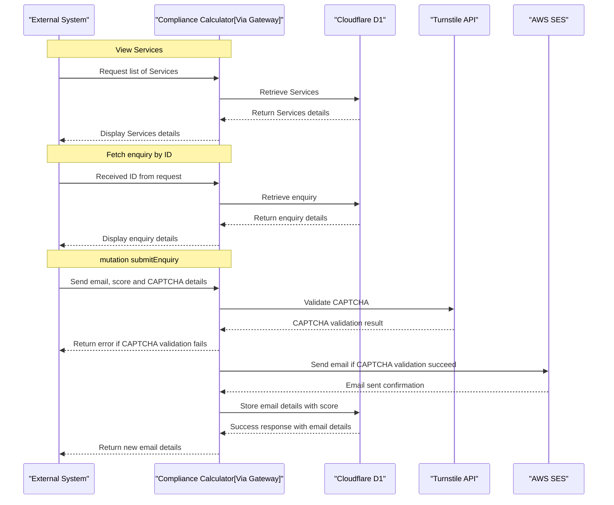
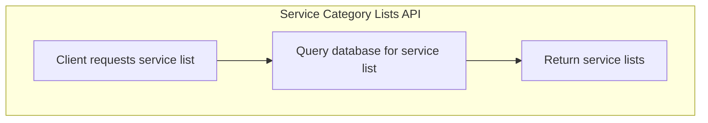
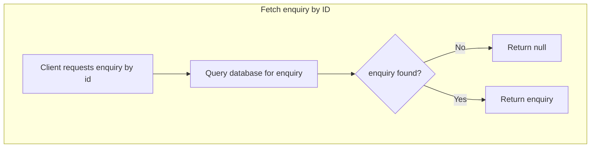
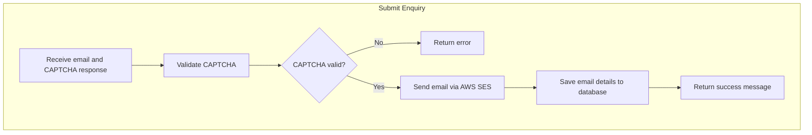

# Compliance Calculator Service - Technical Design Document

## 1. Introduction

### 1.1 Name

Compliance Calculator Service

### 1.2 Description

The Compliance Calculator Service is responsible for syncing a list of services from Google Sheets to a database, querying and retrieving the service list, sending emails using AWS SES, validating CAPTCHA using Turnstile, and saving the details in the database.

## 2. External Values

N/A

## 2.1 Required Headers

N/A

## 3. Interfaces

**Purpose:** Serve as the primary interface for interacting with the Compliance Calculator Service functionalities

- **API**: GraphQL API
- **Protocols Used**: GraphQL over HTTPS
- **Google Sheets API**: Syncing service list
- **AWS SES API**: Sending emails
- **Turnstile CAPTCHA API**: CAPTCHA validation

## 4. Access Patterns / Responsibilities

1. **Sync Service List**:

   - Fetch the data from Google Sheets.
   - Update the database with the fetched services.

2. **Retrieve Service List**:

   - Create a query to retrieve the service list from the database.

3. **Submit Enquiry**:
   - Use AWS SES to send emails.
   - Validate the CAPTCHA using Turnstile.
   - Save the details in the database, including:
     - Email address
     - Selected services
     - Compliance score
     - Message
     - Timestamps

## 5. Dependencies

N/A

## 6. Infrastructure

### 6.1 Hardware and Software Requirements

- **Hosting**: Cloud-based hosting environment
- **Data Storage**: Cloudflare D1

### 6.2 Programming Languages and Frameworks

- **Languages**: Typescript, GraphQL
- **Frameworks**: Node JS, GraphQL Yoga
- **Tools**: Cloudflare Workers

## 7. DB Structure

1. Table name : category

| Column Name | Data type | Description |
| :---------: | :-------: | ----------- |
|     id      |   TEXT    | Primary key |
|    name     |   TEXT    |             |
| description |   TEXT    |             |
| created_at  | DATETIME  |             |
| updated_at  | DATETIME  |             |

2. Table name : service

|        Column Name         | Data type | Description                                           |
| :------------------------: | :-------: | ----------------------------------------------------- |
|             id             |   TEXT    | Primary key                                           |
|        category_id         |   TEXT    | foreign key -> category(id)                           |
|            name            |   TEXT    |                                                       |
|          purpose           |   TEXT    |                                                       |
|          benefit           |   TEXT    |                                                       |
|      when_to_opt_for       |   TEXT    |                                                       |
|    is_legally_required     |  Boolean  |                                                       |
|   service_necessity_tier   |   TEXT    | Elective Perks, Core Services, Strategic Enhancements |
|  implementation_frequency  |   TEXT    |                                                       |
| business_scale_suitability |   TEXT    |                                                       |
|  employee_lifecycle_stage  |   TEXT    |                                                       |
|       primary_focus        |   TEXT    |                                                       |
|      scope_of_impact       |   TEXT    |                                                       |
|         weightage          |   REAL    |                                                       |
|          disabled          |  Boolean  |                                                       |
|         created_at         | DATETIME  |                                                       |
|         updated_at         | DATETIME  |                                                       |

3. Table name : enquiry

|     Column Name     | Data type | Description                |
| :-----------------: | :-------: | -------------------------- |
|         id          |   TEXT    | Auto-increment Primary key |
|        email        |   TEXT    |                            |
|       message       |   TEXT    |                            |
|  selected_services  |   TEXT    |                            |
|  compliance_score   |    INT    |                            |
|  progressive_score  |    INT    |                            |
| comprehensive_score |    INT    |                            |
|  captcha_response   |   TEXT    |                            |
|     created_at      | DATETIME  |                            |
|     updated_at      | DATETIME  |                            |

## 8. GraphQL API

**Graphiql Instance URL :** https://graphql-previewer.kaosagency.workers.dev/dZ9b7dm7azWzQ2DGsDBi2

### 8.1 Functions

```
Functions : syncServices
    - Method: GET
    - Sync data from Google Sheet API
```

### 8.3 Resolver Logics (or Implementation Details)

1. `serviceCategoryLists`

   1. Retrieve services data from database.
   2. The resolver returns the list of services.

2. `submitEnquiry`

   1. The mutation receives input parameters (`submitEnquiryInput`)
   2. Validate the CAPTCHA response using Turnstile API.
   3. If CAPTCHA validation fails, return `is_captcha_valid` as false
   4. If CAPTCHA validation is successful, Use `AWS SES` to send an email to the specified recipient.
   5. The resolver returns response with `is_captcha_valid` as true and confirm that the email has been sent.

3. `syncServices`

   1. Fetch data from Google Sheets using the Google Sheets API(https://sheets.googleapis.com/v4/spreadsheets/{SHEET_ID}/values/services?alt=json&key={SHEET_API_KEY}).
   2. Parse the data and extract necessary fields.
   3. Validate the extracted data.
   4. Insert the data into the category and services table in the database. Use `ON CONFLICT` to handle conflicts during insertion and update existing rows with new values.

   `Note : The Google Sheets file ID (SHEET_ID) and API key (SHEET_API_KEY) are securely stored as environment variables to ensures they can be managed securely`

4. `enquiry`

   1. The query receives id from the request.
   2. If the enquiry is found, return it.
   3. If the enquiry is not found, return null

5. `Enquiry`
   1. A custom resolver for `selected_services` in the Enquiry type.
   2. Extract the list of service IDs from the selected_services field of the Enquiry.
   3. Execute a query to fetch the service details from the D1 database for the given list of service IDs.
   4. Return the fetched service details.

### 8.4 Error Handling

- **General Principles**

1. **Explicit Error Types**: Define custom error types that clearly describe different error conditions. This helps clients understand the nature of the error and how to respond to it.
2. **Error Codes**: Assign unique error codes to different types of errors for easy identification and localisation of error messages.
3. **Consistent Structure**: Ensure that all errors returned from the API have a consistent structure, making it easier for clients to parse and handle errors.
4. **Detailed Messages**: Provide detailed error messages that offer insights into why an operation failed. This can include validation failures, system errors, or execution issues.
5. **User-Friendly Language**: Error messages should be in user-friendly language, avoiding technicalities that may not be understandable to end users.

- **Implementing Error Responses**

**GraphQL Error Object**: Utilize the GraphQL `errors` object to return errors. Each error can include:

1. **`message`**: A human-readable error message.
2. **`extensions`**: An optional field that can include additional details such as error codes, type of error, and other relevant information.

### 8.5 Testing

- **Unit Tests**
  - Individual functions like `serviceCategoryLists`, `submitEnquiry`, `syncServices`. Validate the logic for this function to ensure that it works as intended in isolation.
- **End-to-End (E2E) Tests**
  - Simulate User workflows to ensure the service operates as expected.

## 9. Diagrams

### 9.1 Sequence Diagrams



### 9.2 Flowcharts







```

## 10. Conclusion

The Compliance Calculator Service provide a robust solution for offers functionalities such as syncing service lists from Google Sheets, querying and retrieving these services, sending emails using AWS SES, validating CAPTCHA using Turnstile, and saving relevant details in the database.
```
